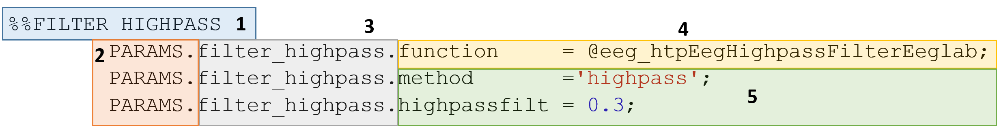

Defining Parameters
^^^^^^^^^^^^^^^^^^^

The key component of the VHTP Preprocessing tool is its flexibility!

We allow users to customize their own pipeline methods and parameters.

In the VHTP base directory, there is a subdirectory labeled 'parameters'.  Within this folder, you must create a MATLAB function file that will dictate what steps are taken during preprocessing and specifies the parameters used to perform these operations.

.. code-block::
	:caption: This is an example of the setup of a typical parameters file:
	
	function [PARAMS] = parameters_InfantTest()
		clear PARAMS;
		%FILTER HIGHPASS
		PARAMS.filter_highpass.function = @eeg_htpEegFilterEeglab;
		PARAMS.filter_highpass.method='highpass';
		PARAMS.filter_highpass.hipassfilt = 0.3;

		%%FILTER NOTCH
		PARAMS.filter_notch.function = @eeg_htpEegFilterEeglab;
		PARAMS.filter_notch.method = 'notch';
		PARAMS.filter_notch.notchfilt=[57 63];
		% PARAMS.filter_notch.saveoutput = true;

		%%FILTER LOWPASS
		PARAMS.filter_lowpass.function = @eeg_htpEegFilterEeglab;
		PARAMS.filter_lowpass.method = 'lowpass';
		PARAMS.filter_lowpass.lowpassfilt=100;
		%PARAMS.filter_lowpass.saveoutput = true;

		% %% WAVELET DENOISING
		 PARAMS.waveletdenoise.function = @eeg_htpEegWaveletDenoiseHappe;
		 PARAMS.waveletdenoise.isErp = true;
		 PARAMS.waveletdenoise.filtOn = true;
		 PARAMS.waveletdenoise.saveoutput = true;

		%%CHANNEL REMOVAL 
		PARAMS.channel_removal.function=@eeg_htpEegRemoveChansEeglab;
		PARAMS.channel_removal.threshold = 3;
		PARAMS.channel_removal.removechannel = true;
		PARAMS.channel_removal.saveoutput = true;
		PARAMS.channel_removal.minimumduration = 0;
		PARAMS.channel_removal.type = 'Event';
		PARAMS.channel_removal.automark = true;
	end

We start with a base structure entitled 'PARAMS'. We then add fields within the PARAMS structure for each preprocessing step.

The following section breaks down the components of one of these fields and the requirements for each preprocessing step.

Setup
""""""""""""""""""""""""""""	

		 
#. This line is optional to include in your function, but makes it a lot easier to follow what is going on. In this example, we have listed "FILTER HIGHPASS" to remind us that this step applies a highpass filter to our data.
	
#. "PARAMS" is required at the start of every line for each preprocessing step in your parameters file.
	
#. This is a user-defined name that can be set to whatever you like, as long as it is a continuous string (no spaces). You could use this to remind us what is happening in this step, as we have here with "filter_highpass," or you could name it something meaningful to you, like "step one" or "step1."
	a. If you decide to save output from this function, the SET file names will include your user defined name (ex: originalfilename_filter_highpass.set).
	b. This part of the function must have a period at the end, as shown.
#. The start of each step should include "function," which tells the script to run the function found in 5.
#. This is where you will tell MATLAB which function to run. A full list of function names can be found in :doc:`Methods`
	a. The function you must have an '@' before the name.
#. These are where you place input parameter names, with one per each line. In the second line, we are adding a parameter to tell it which method to use; in the third line, we are telling it what frequencies to use for the highpass filter.
#. These are the values we would like to apply to the optional parameters.
	